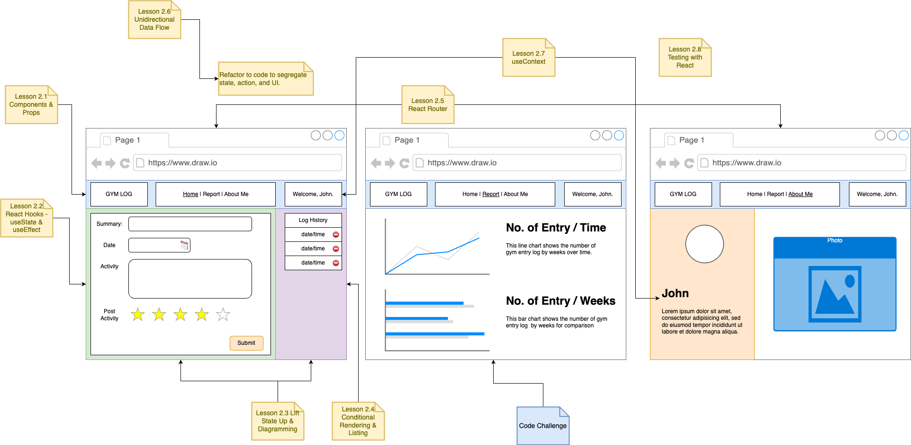
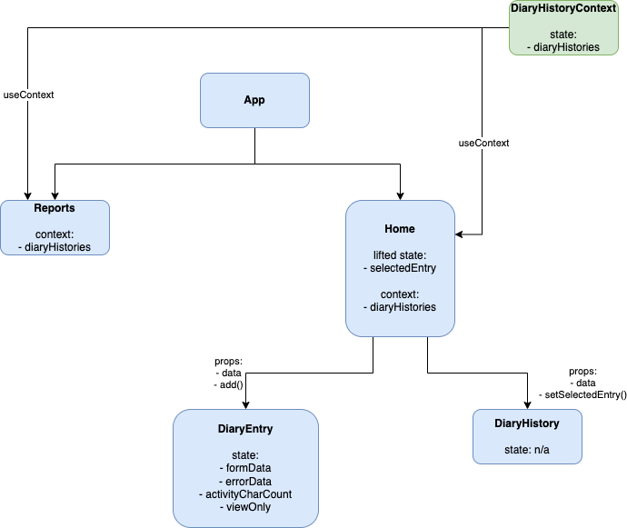

# Lesson

## Lesson Overview

By the end of the entire React lessons, a Gym Diary web application will be produced. Each lesson will contribute to different aspects of the application. 



A react project has been creating for you in the [lesson](./src/lesson/) folder. Snippets of code will be added to it from lesson and homeworks until we produce the above described Gym Diary web application.

> Professional projects would use CSS Libraries such as Bootstrap or Tailwind. In this React project, Tailwind is configured.

Project Versions:
- Node 18
- React 18
- React Router 6

## Starter Code Observation

The starter code is equivalent to the completion of previous lesson's homework.

## Complete Code Expectation

By the end of the lesson, the code base will be able to:

1. Create presentational and container components to display added entries

---

## Part 1 - Thinking in React & Diagramming

By this lesson, learners have already completed the functionality of the gym diary frontend application. To appreciate "Thinking in React", learners should understand how the following concept works:

1. Component
1. Props - data passed from parent to child
1. State - data that is updatable within a component
1. Inverse Data Flow - passing data from child to parent via a function
1. Lifting State Up - sharing state from parent to multiple children


### Coding Principle - Single Responsibility

In Object Oriented Design, SOLID is a common set of principles developers could follow to write high quality code. SOLID stands for:

> Intro SOLID to learners, focus on Single Responsibility. SOLID introduction should not take longer than 10 mins.

|Principle|Meaning|
|-|-|
|S: Single Responsibility Principle|An entity should have a single responsibility.|
|O: Open-close Principle|An entity should be open for extension but close for modification.|
|L: Liskov Substitution Principle|The child entity replace the parent entity without side effects.|
|I: Interface Segregation Principle|Interface should not be generate. They must be segregated for optimal granularity usage.|
|D: Dependency Inversion Principle|Classes should depend on interface or abstract class, not the other way round.|

*In React, one way to enforce separation of concerns (Single Responsibility Principle) is by using the Container/Presentational pattern. With this pattern, we can separate the view from the application logic. Excerpt from patterns.dev*

Refer to code in patterns.dev [link](https://www.patterns.dev/posts/presentational-container-pattern) to better understand container and presentation container pattern.

## Part 2 - Retrospective with Component Diagram

There is no standard approach to draft this diagram. The goal of diagramming are:

1. Help us plan our code accordingly
1. Communcate components and data flow to the team members

Observe this component diagram (excludes top header, reports, and about me):



What can you tell from this diagram?

Observations:

- Home and Reports components has a context data passed from DiaryHistoryContext
- Home component stores `selectedEntry` and `diaryHistories`
- Home component provides `data` and `add()` to DiaryEntry component
- DiaryEntry has four states
- DiaryHistory has zero state

> Set aside 10 minutes for class sharing and learnings from instructor.

---

## Part 2 - Deployment

Step 1: Create a new repository with the name `gym-diary` in your GitHub.com account

Step 2: Add `gym-diary/*` to the repository (`package.json` is in the root directory)

Step 3: Sign up an account with [cyclic.sh](https://cyclic.sh/)

Step 4: Connect the repository to cyclic and perform a deployment. Your repository URL should be `https://github.com/your_username/gym-diary`.

<<<<<<< HEAD
Step 5: Review the URL given by cyclic.sh to ensure your project is deployed
=======
```jsx
const TopMenuContainer = () => {

    return <div className="flex justify-between border border-green-500 p-2 absolute w-full top-0">
        <div className="border border-black p-4">Logo</div>
        <div className="border border-black p-4">Hyperlinks</div>
        <div className="border border-black p-4">Welcome, John</div>
    </div>
}

export default TopMenuContainer;
```

> In this course, we will stick to the file extension `.jsx` for JSX code although `.js` extension still work. More info [here](https://github.com/airbnb/javascript/pull/985).

Step 4: Import `<TopMenuContainer />` into `<App />`:

```js
import React from 'react';
import TopMenuContainer from './components/top-menu/container'; // Add this line
```

Step 5: Replace the JSX returned by `<App />` with a single `<TopMenuContainer />`:

App.js will look like this:

```js
import React from 'react';
import TopMenuContainer from './components/top-menu/container';

function App() {
  return (
    <div>
      <TopMenuContainer /> 
    </div>
  );
}

export default App;
```

---

## Part 3 - Passing Props

In this part, we will convert the third `<div>` in `Container.jsx` that displays welcome message into a separate component.

```jsx
const TopMenuContainer = () => {

    return <div className="flex justify-between border border-green-500 p-2 absolute w-full top-0">
        <div className="border border-black p-4">Logo</div>
        <div className="border border-black p-4">Hyperlinks</div> 
        <div className="border border-black p-4">Welcome, John</div> {/* This <div> */}
    </div>
}

export default TopMenuContainer;
```

Step 1: Create `Welcome.jsx` in the same folder as `Container.jsx`.

Step 2: Implement these code in `Welcome.jsx`:

```js
const Welcome = (props) => {

    return (
        <div className="border border-black p-4 flex flex-col justify-center">
            Welcome, {props.currentUser}
        </div>
    );
}

export default Welcome;
```

Observation:
- The `Welcome` functional component takes in an argument `props`
- The `props` is an object that looks like the following:
    ```js
    {
        currentUser:"Mary"
    }
    ```
- The `currentUser` property within the `props` is passed from `Container.jsx`

Step 3: Import `<Welcome />` component in `Container.jsx`.

```js
import Welcome from "./welcome";
```

Step 4: Replace the third `<div>` with `<Welcome />` component.

`Container.jsx` will look like this:
```js
import Welcome from "./welcome";

const username = "Mary"; // If you change this value, it will reflect in the <Welcome/> component.

const TopMenuContainer = () => {

    return <div className="flex justify-between border border-green-500 p-2 absolute w-full top-0">
        <div className="border border-black p-4">Logo</div>
        <div className="border border-black p-4">Hyperlinks</div>
        <Welcome currentUser={username} /> {/* Replaced */}
    </div>
}

export default TopMenuContainer;
```

## Part 4 (Optional) - Using Destructuring Syntax

A destructuring syntax break the properties of an object into variables:

```js
// An object with two properties
const exercise = {
    name:"Push Up",
    reps:10
}

// Destructuring syntax
const {name, reps} = exercise;
console.log(`Exercise: ${reps} ${name}`); // prints "Exercise: 10 Push Up"
```

We could use destructuring syntax on the props of `Welcome.jsx`. The new code will look like this:

```js
// Destructuring syntax in the argument
const Welcome = ({currentUser}) => {

    return (
        <div className="border border-black p-4 flex flex-col justify-center">
            Welcome, {currentUser}
        </div>
    );
}

export default Welcome;
```
>>>>>>> main

END